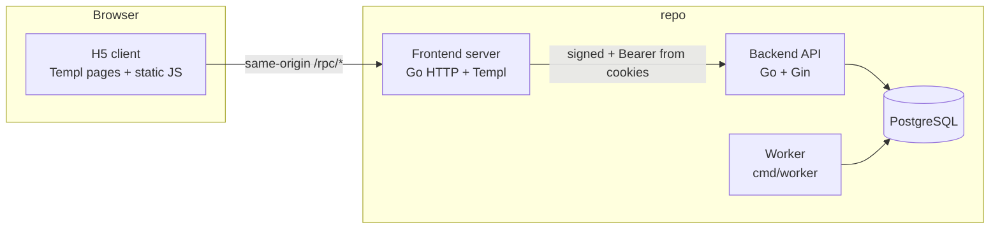

# Meridian Operations Hub — Design Document

## 1. Purpose

This document describes the **Meridian Operations Hub** system as implemented under **`repo/`** (`backend/` and `frontend/` per `repo/README.md`): an offline-first operations platform for a mid-sized US direct-to-consumer retailer, covering **hiring**, **customer support**, **inventory**, and **compliance**, with strong RBAC and local-network security controls.

Primary users (by role): System Administrators, HR Recruiters, Hiring Managers, Warehouse Clerks, Customer Service Agents, and Compliance Officers—each constrained by module permissions and scope rules.

---

## 2. System Goals

- Run entirely on an **isolated local network** with no dependency on public cloud for core operation.
- Provide an **H5 mobile-first** web UI (Templ + responsive CSS + client JS) for floor and warehouse staff, with a **Go BFF** that proxies signed API calls and holds **HttpOnly** session cookies.
- Enforce **authorization on the backend** (permissions + site/warehouse scopes + object-level filtering where implemented).
- Support **deterministic business rules** (e.g. after-sales eligibility, SLA due times, inventory reservations and immutable ledger with reversal).
- Meet **security** expectations: JWT access + opaque refresh, lockout, step-up for sensitive actions, **signed requests** with nonce anti-replay, **idempotency** for selected mutations.

---

## 3. High-Level Architecture

### Runtime services (typical Compose / local)

| Service | Role | Default port (README) |
| :--- | :--- | :--- |
| **Backend API** | REST API, auth, domain handlers, migrations on boot | `8080` |
| **Frontend / BFF** | HTML pages, `/rpc/login`, `/rpc/refresh`, `/rpc/logout`, `/rpc/api/*` proxy | `8081` |
| **Worker** | Scheduled / background jobs (e.g. reservation expiry, retention) | n/a (process) |
| **PostgreSQL** | System of record | container / local |

---

## 4. Backend Design

### 4.1 Layout

- **Entry:** `repo/backend/cmd/api/main.go` — Gin engine, middleware chain, route registration.
- **Handlers:** `repo/backend/internal/http/handlers/` — `auth`, `hiring`, `support`, `inventory`, `admin`, `compliance`.
- **Middleware:** `repo/backend/internal/http/middleware/` — signing, JWT access, permissions, scopes, idempotency (selected POSTs), step-up, kiosk token, audit writes.
- **Services / platform:** `repo/backend/internal/service/*`, `repo/backend/internal/platform/*` — DB, security (tokens, PII encryption helpers), migrations.

### 4.2 Cross-cutting middleware (order matters)

On `/api` group (see `repo/backend/cmd/api/main.go`):

1. **RequireSignedRequests** — client key, timestamp window, HMAC, nonce insert (replay → 409).
2. **RequireAccessToken** — JWT access validation; sets actor context.
3. **AuditWrites** — audit trail for mutating requests (where configured).
4. **Routes** — `POST /api/auth/step-up`, `GET /api/auth/me` registered **before** the next middleware applies to subsequent routes.
5. **RequireIdempotency** — for routes registered after this `Use`, only **`POST`** paths listed in `RequireIdempotency` (see `idempotency.go`) **require** `Idempotency-Key`:
   - `POST /api/inventory/reservations/order-create`
   - `POST /api/support/tickets/refund-approve`  
   Other `POST`s pass through without a key.

### 4.3 Security model

- **Local login:** username/password; minimum password length **12**; **lockout** after **5** failed attempts for **15 minutes**.
- **Sessions:** short-lived **JWT access** + **opaque refresh** stored in DB; frontend BFF sets **HttpOnly** cookies for browser sessions.
- **Step-up:** password re-check yields a short-lived step-up token for privileged operations (refunds, role changes, ledger reversal, key revoke, compliance deletion processing, audit export).
- **Kiosk:** public application submission via `/kiosk/applications` with signing + shared **kiosk secret** header (no staff JWT).
- **Data protection:** SSN and similar fields—masking in UI/API responses where applicable; encryption-at-rest for sensitive columns (see README / PII key bootstrap).

### 4.4 Domain modules (API surface)

- **Hiring:** jobs, applications (manual/kiosk/CSV), pipeline templates, transitions, events, candidates, blocklist rules.
- **Support:** orders list (and `for-intake` variant for narrow roles), tickets, attachments, updates, conflict resolution, refund approval (step-up + idempotency).
- **Inventory:** orders list (and `for-intake`), balances, reservations (order create/cancel/confirm/release), inbound/outbound/transfer, cycle counts, immutable ledger + reversal (step-up).
- **Admin:** roles, permissions, scopes, client key rotate/revoke (step-up).
- **Compliance:** crawler run/status, deletion requests, retention status, audit logs + export (export step-up).

---

## 5. Frontend Design

### 5.1 Stack

- **Server:** Go `net/http` mux, **Templ**-generated HTML, static assets under `repo/frontend/ui/static/` (`css/theme.css`, `js/app.js`).
- **Client:** Vanilla JavaScript for `fetch`, offline retry queue, support drafts, optimistic flows, permission-driven visibility. Module result areas use **structured panels** (tables, labeled key/value summaries) with an optional **collapsible raw JSON** block for debugging—implemented in `app.js` (`setRichPanel`, `renderDataTable`, `renderDl`, `renderDetailJson`).

### 5.2 Routes (HTML)

| Path | Notes |
| :--- | :--- |
| `/` | Login |
| `/dashboard` | Overview (session required) |
| `/hiring` | Hiring module |
| `/hiring/kiosk` | Public kiosk intake |
| `/hiring/kiosk/qr` | QR PNG for kiosk URL |
| `/support` | Tickets |
| `/inventory` | Stock moves, reservations |
| `/compliance` | Crawler, retention, deletion, audit |

Protected pages: **session cookie** present and validated (BFF calls `/api/auth/me` with cookie-derived Bearer). Unauthenticated users are **redirected to `/`**.

### 5.3 BFF / RPC

- **`POST /rpc/login`**, **`POST /rpc/refresh`** — proxy to backend auth; set/clear HttpOnly cookies.
- **`POST /rpc/logout`** — clear cookies.
- **`/rpc/api/*`** — strip `/rpc`, sign request, forward to backend `/api/*`, attach `Authorization` from access cookie if needed. The BFF forwards `Idempotency-Key` and `X-Step-Up-Token` when present.

Browser **normal operation** does not persist access/refresh JWTs in `sessionStorage`; limited **UX state** (e.g. display user, step-up token, draft keys) may live in `sessionStorage` / scoped `localStorage`.

### 5.4 RBAC in the UI

After session establishment, client loads **`/rpc/api/auth/me`** and toggles nav/actions from `permissions` / `scopes`. **Backend remains authoritative**; UI hiding is defense in depth.

### 5.5 Offline / weak network (support)

- Local draft and retry queue patterns in client JS (see README: offline drafts, optimistic updates, conflict prompts).
- **Service worker** is not required for the described MVP; caching boundaries are localStorage/sessionStorage + server session.

---

## 6. Core Workflows (summary)

### 6.1 Hiring

1. Recruiters create jobs and ingest applications (manual, staff kiosk, CSV).
2. Pipeline templates define stages; transitions move applications; blocklist rules can flag or block.
3. Kiosk path allows unauthenticated candidate submit via signed `/kiosk/applications`; job choices for the kiosk come from signed `GET /kiosk/jobs`.
4. Staff UIs may call `GET /api/hiring/jobs/for-intake` when the user lacks `hiring:view` but has `hiring:create` (dropdown population).

### 6.2 Support

1. Agents create/update tickets tied to orders; order lists come from `GET /api/support/orders` (or `.../orders/for-intake` for narrow roles). Attachments per product rules.
2. Return/refund eligibility enforced server-side; SLA due times computed with business calendar configuration.
3. Optimistic concurrency: conflict resolution endpoint; client shows retry/conflict UX.

### 6.3 Inventory

1. Inbound/outbound/transfer/cycle counts update balances and write **ledger** entries (immutable; reversal via dedicated endpoint).
2. Order pickers use `GET /api/inventory/orders` (or `.../orders/for-intake`). Reservations use **site** codes (e.g. `SITE-A`) for allocation, not sub-warehouse labels.
3. Orders create **reservations** with holds; cancel/confirm/release paths; worker can auto-release expired holds.

### 6.4 Compliance

1. Crawler indexes approved sources within policy (caps, opt-out).
2. Retention and deletion requests; audit log query and export (gated + step-up for export).

### 6.5 Admin

1. Role permission and scope management with step-up.
2. API client key rotation/revocation for signing clients.

---

## 7. Data and Persistence (high level)

PostgreSQL holds users, roles, permissions, scope rules, refresh/step-up tokens, client keys/nonces/idempotency records, hiring entities, support tickets, inventory balances/reservations/ledger, compliance crawler and audit data, and encrypted sensitive fields (e.g. candidate SSN material) per migrations under `repo/backend/migrations/`.

---

## 8. Observability and Reliability

- Gin default logging; audit middleware for write operations where enabled.
- **Health:** `GET /healthz`.
- **Worker** process runs jobs against the same DB (reservation expiry, retention, etc.)—see `repo/backend/cmd/worker`.
- Test harness reliability is implemented in scripts: `repo/run_tests.sh` auto-starts Compose stack when services are unavailable, and `repo/e2e_tests/run_e2e_tests.sh` installs Playwright Chromium runtime before executing browser tests.

---

## 9. Assumptions and Constraints

- Single-tenant / single-org style deployment on a trusted local network.
- H5 client and BFF are **same-origin** so HttpOnly cookies and `/rpc` proxying work without CORS complexity for the main app.
- External identity providers and multi-region deployment are **out of scope** for this design doc.

---

## 10. Non-Goals (current scope)

- Public SaaS multi-tenancy and per-tenant billing.
- Mobile native apps (web H5 only).
- TrailForge / sports / Vue / Koa / MySQL stack (superseded by this repository’s Meridian implementation).

---

## 11. References

- Product routes and env: `repo/README.md`
- API route list: `repo/backend/cmd/api/main.go`
- API detail tables: `docs/api-spec.md`
